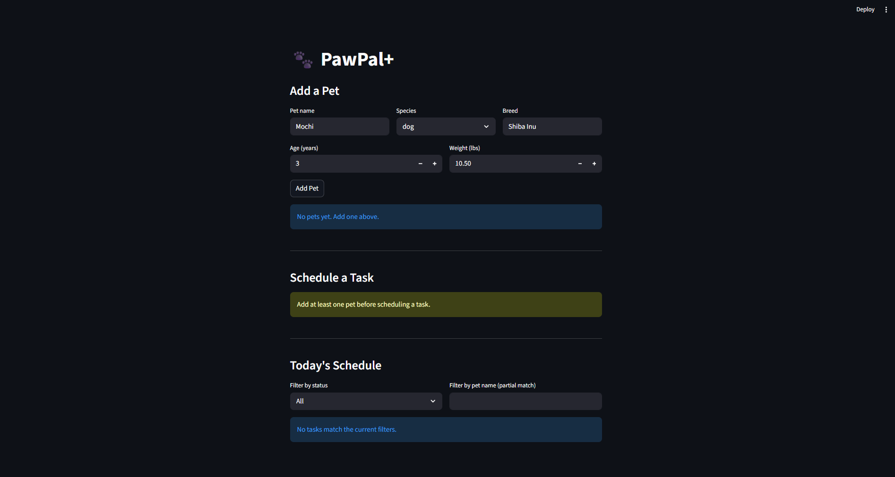

# 🐾 PawPal+ AI Scheduler

## Overview

PawPal+ is an intelligent pet care management system that uses an Agentic AI workflow to automatically resolve scheduling conflicts. This project transforms manual task management into a smart, self-healing schedule that prioritizes high-importance pet care activities.

## Original Project Context

A busy pet owner needs help staying consistent with pet care. They want an assistant that can:

- Track pet care tasks (walks, feeding, meds, enrichment, grooming, etc.)
- Consider constraints (time available, priority, owner preferences)
- Produce a daily plan and explain why it chose that plan

Your job is to design the system first (UML), then implement the logic in Python, then connect it to the Streamlit UI.

### What you will build

Your final app should:

- Let a user enter basic owner + pet info
- Let a user add/edit tasks (duration + priority at minimum)
- Generate a daily schedule/plan based on constraints and priorities
- Display the plan clearly (and ideally explain the reasoning)
- Include tests for the most important scheduling behaviors

### Architecture Overview
The system is divided into three main components:
1. **Frontend (Streamlit):** The user interface where owners add pets, schedule tasks, and view their daily itinerary.
2. **Core System (`pawpal_system.py`):** A robust object-oriented backend containing `Task`, `Pet`, and `Scheduler` classes that manage state and detect time-window overlaps.
3. **AI Agent (`ai_agent.py`):** The LLM-powered engine. When a conflict is detected by the Scheduler, the UI passes the conflicting tasks to the Agent. The Agent evaluates priorities and durations, queries the LLM with a strict system prompt, and returns a JSON payload with optimized start times. The Scheduler then parses this payload and mutates the task states.

## Getting started

### Setup Instructions
To run this project locally, follow these steps:

1. Clone the repository and navigate to the project directory.
2. Create a virtual environment and activate it.
3. Install the required dependencies:
   ```bash
   pip install -r requirements.txt

### Sample Interactions

**Scenario 1: Same-Pet Conflict**
* **Input State:** Mochi (Dog) has a 60-minute "Vet Checkup" (HIGH priority) at 09:00 and a 30-minute "Grooming" (MEDIUM priority) at 09:20.
* **AI Output:** The system detects the overlap. The AI Agent processes the conflict and returns: `{"task_vet": "09:00", "task_grooming": "10:15"}`.
* **Result:** The UI updates, keeping the Vet Checkup fixed while pushing Grooming safely past the checkup's completion window.

**Scenario 2: Owner Time Clash**
* **Input State:** Luna (Cat) has a 5-minute "Feeding" (HIGH priority) at 08:00. Mochi (Dog) has a 30-minute "Morning Walk" (HIGH priority) at 08:00.
* **AI Output:** The system detects the owner cannot do both simultaneously. The Agent returns: `{"task_feeding": "07:50", "task_walk": "08:00"}`.
* **Result:** The AI intelligently shifts the shorter, indoor task slightly earlier to ensure both high-priority tasks are completed efficiently.

### Design Decisions
* **Agentic Workflow over RAG:** I chose to build an active agent rather than a passive information retriever because it provides more direct value to the user. Fixing a broken schedule is a complex logic puzzle that showcases the LLM's reasoning capabilities better than simple text generation.
* **Separation of Concerns:** I kept the AI logic (`ai_agent.py`) strictly separated from the domain models (`pawpal_system.py`). This ensures the core object-oriented system remains deterministic and easily testable, while the non-deterministic AI acts only as an external service.
* **Strict JSON Enforcement:** To bridge the gap between natural language processing and programmatic execution, I engineered the LLM prompts to return flat JSON arrays and implemented fallback parsing to handle unexpected markdown formatting.

### Testing Summary
Testing non-deterministic AI outputs presented unique challenges. 
* **What Worked:** The core overlap detection algorithms reliably caught edge cases (e.g., partial overlaps, exact same-start collisions). The LLM was consistently excellent at respecting the durations and shifting lower-priority tasks.
* **What Didn't:** Early iterations crashed when the LLM hallucinated time formats (e.g., "9:00 AM" instead of "09:00") or wrapped the JSON payload in markdown blocks. 
* **What I Learned:** I implemented robust string cleaning, regex filtering, and `try/except` guardrails to ensure that if the AI fails or hallucinates, the application degrades gracefully rather than crashing.

### Reflection
This project fundamentally changed how I view AI integration. Instead of treating an LLM like a chatbot, I learned how to use it as a functional component within a larger software architecture. Bridging deterministic Python objects with probabilistic AI reasoning required careful prompt engineering and rigorous error handling. It reinforced the importance of building solid, traditional software foundations before adding AI layers on top.


### 🧪 Testing Summary
3 out of 3 automated unit tests passed using `pytest`. The system successfully parsed simulated LLM outputs, stripped unexpected markdown formatting, and gracefully handled API failure simulations without crashing. Adding regex string cleaning significantly improved reliability when the LLM hallucinated code blocks.

##Demo
